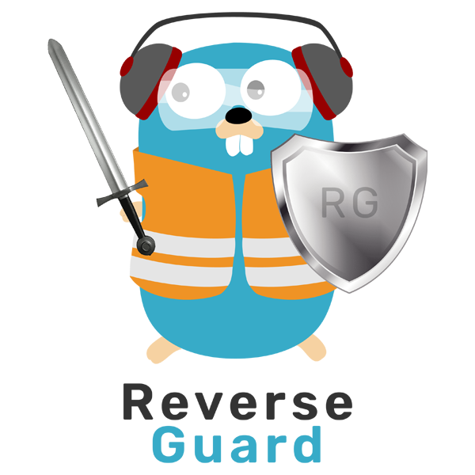

<p align="center">

</p>

[](https://github.com/WagnerPMC/reverseguard/actions/workflows/tests.yml)
[](https://codecov.io/gh/WagnerPMC/reverseguard)
[](https://goreportcard.com/report/github.com/WagnerPMC/reverseguard)

# ReverseGuard. The Traefik plugin.
## Description
The plugin comes as middleware and allows you to accept incoming requests only from trusted subnets. Subnets can be static or dynamic, placed in files or accessible by URL, with the ability to update at a specified interval.
If the request was made from a trusted subnet, header rules can be applied to it. Also, in order not to disclose the presence of the web server, you can set a 404 code instead of a 403 code, which will be sent if the incoming IP address is not trusted.

__This plugin is in testing mode, but can already be used in a production environment. Therefore, use it with caution. Report all bugs to Issues.__

## Configuration
### Example
The plugin comes as middleware, and can be configured as shown below:

traefik.static.yml
```yaml
experimental:
  plugins:
    reverseguard:
      moduleName: "github.com/WagnerPMC/reverseguard"
      version: "v0.1.0"
```

traefik.dynamic.yml
```yaml
http:
  routers:
    someRouter:
      rule: "Host(`demo.com`)"
      middlewares:
        - guard

middlewares:
  guard:
    plugin:
      reverseguard:
        map:
          cloudflare:
            dynamic_cidrs:
              - url: "https://www.cloudflare.com/ips-v4"
                interval: "5m"
              - url: "https://www.cloudflare.com/ips-v6"
                interval: "5m"
```

### Reference

Sample configuration.

__Note that without a correctly configured "map" section, this plugin will not work!__

```yaml
# If none of the guards in the "map" section missed a request,
# instead of a 403 code and empty content, a 404 code will be
# given along with "404 page not found" content.
rewrite_403:
  code: 404
  content: "404 page not found" # optional
map:
  # Add a guard for Cloudflare
  cloudflare:
    # Dynamic subnet lists
    dynamic_cidrs:
      # Update the list "https://www.cloudflare.com/ips-v4" every 5 minutes.
      - url: "https://www.cloudflare.com/ips-v4" # required
        interval: "5m" # required. Valid literals: s, m, h, d, w.
      - url: "https://www.cloudflare.com/ips-v6"
        interval: "5m"
    # If the request came from the Cloudflare subnet, we apply the header rules:
    header_actions:
      # Creates (with override) the x-real-ip header based on the value of the cf-connecting-ip header (if any).
      - action: copy             # required
        source: cf-connecting-ip # required
        target: x-real-ip        # required where action is copy or rename
      # Renames (with override) the cf-connecting-ip header (if any) to x-real-ip.
      - action: rename
        source: cf-ipcountry
        target: x-real-country  # required where action is rename
      # Removes the cf-ipcountry header (if any).
      - action: delete
        source: cf-connecting-ip
        
  # Add a guard for StormWall
  stormwall:
    #  Static subnet list
    static_cidrs:
      - 193.84.78.0/24
      - 185.121.240.0/22
      - 188.0.150.0/24
      - 103.134.155.0/24
    header_actions:
      - action: copy
        source: x-forwarded-for
        target: x-real-ip
```

## Author
PMC Wagner. M-333C badge.

## License
See the LICENSE file.